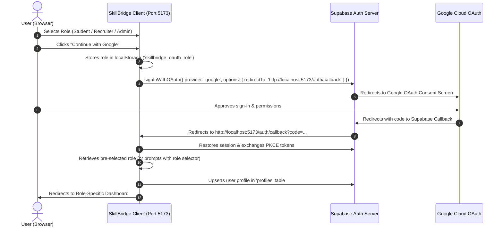

# Google OAuth 2.0 Setup Guide for SkillBridge

This guide provides step-by-step instructions for configuring Google Sign-In with Supabase Auth for SkillBridge in both local development and production environments.

---

## 1. Authentication Architecture Overview



---

## 2. Google Cloud Console Setup

### Step 2.1: Create or Select a Project
1. Navigate to [Google Cloud Console](https://console.cloud.google.com/).
2. Select your existing project or create a new project named **SkillBridge**.

### Step 2.2: Configure OAuth Consent Screen
1. Go to **APIs & Services** > **OAuth consent screen**.
2. Select **External** user type and click **Create**.
3. Fill in the App Information:
   - **App name**: `SkillBridge`
   - **User support email**: Your admin/support email
   - **Developer contact information**: Your email
4. Click **Save and Continue**.
5. Under **Scopes**, add the standard scopes:
   - `.../auth/userinfo.email`
   - `.../auth/userinfo.profile`
   - `openid`
6. Click **Save and Continue**, then add Test Users (if in Testing status) and finish.

### Step 2.3: Create OAuth 2.0 Client Credentials
1. Go to **APIs & Services** > **Credentials**.
2. Click **+ CREATE CREDENTIALS** > **OAuth client ID**.
3. Choose **Application type**: `Web application`.
4. Set **Name**: `SkillBridge Web Client`.
5. **Authorized JavaScript origins**:
   - For Local Dev: `http://localhost:5173`
   - For Production: `https://your-production-domain.com` (or Render / Vercel domain)
6. **Authorized redirect URIs** (CRITICAL STEP):
   > **Note:** This MUST point to your Supabase project's auth callback handler, NOT your frontend localhost.
   - Format: `https://<YOUR-PROJECT-REF>.supabase.co/auth/v1/callback`
   - Example: `https://xyzcompanyabcdef.supabase.co/auth/v1/callback`
7. Click **Create**.
8. Copy your **Client ID** and **Client Secret**.

---

## 3. Supabase Dashboard Configuration

### Step 3.1: Enable Google Provider
1. Log in to [Supabase Dashboard](https://supabase.com/dashboard) and select your project.
2. Navigate to **Authentication** > **Providers** > **Google**.
3. Toggle Google to **Enabled**.
4. Paste the **Client ID** and **Client Secret** copied from Google Cloud Console.
5. Click **Save**.

### Step 3.2: Configure Redirect URLs (Site URL & Allowed Redirects)
1. In Supabase Dashboard, go to **Authentication** > **URL Configuration**.
2. **Site URL**:
   - For Local Dev: `http://localhost:5173`
   - For Production: `https://your-production-domain.com`
3. **Additional Redirect URLs**:
   Add the following redirect URLs:
   - `http://localhost:5173/auth/callback`
   - `http://localhost:5173/**`
   - If deploying to production, also add:
     - `https://your-production-domain.com/auth/callback`
     - `https://your-production-domain.com/**`
4. Click **Save**.

---

## 4. Local Environment Configuration

In your project root (or inside `client/.env` and `server/.env`):

```bash
# client/.env
VITE_SUPABASE_URL=https://<your-project-ref>.supabase.co
VITE_SUPABASE_ANON_KEY=<your-public-anon-key>
VITE_API_URL=http://localhost:5000
```

> **Security Rule:** Never commit real API keys, service role keys, or OAuth secrets to git or any public repository.

---

## 5. Testing the Flow

### 5.1 With Active Supabase & Google Credentials
1. Start the development server:
   ```bash
   npm run dev
   ```
2. Open `http://localhost:5173` in your browser.
3. Click **Sign In** in the top navigation bar.
4. Select your desired role: **Student**, **Recruiter**, or **College Admin**.
5. Click **Continue with Google**.
6. You will see the loading state: **"Redirecting to Google…"**
7. Sign in via your Google account.
8. Upon redirect back to `/auth/callback`, the app will automatically verify session tokens, sync your role to the database, and open your role-specific dashboard!

### 5.2 Without Credentials (Local Sandbox Demo Mode)
If `VITE_SUPABASE_URL` and `VITE_SUPABASE_ANON_KEY` are not set or are placeholder values:
- The app automatically runs in **Local Sandbox Mode**.
- In the Sign In modal, click **"Quick Sandbox Demo Access"** to immediately test any persona (Student, Recruiter, or College Admin) with zero setup required.
- If `/auth/callback` receives an error or missing configuration, diagnostic cards provide instant 1-click Demo access.

---

## 6. Common OAuth Error Codes & Troubleshooting

| Error Code | Root Cause | Solution |
| :--- | :--- | :--- |
| `redirect_uri_mismatch` | Google Cloud Console does not have Supabase's callback URL in its Authorized redirect URIs. | Add `https://<your-project-ref>.supabase.co/auth/v1/callback` to Authorized redirect URIs in Google Cloud Console Credentials. |
| `access_denied` | The user closed the Google consent dialog or clicked cancel. | Normal user action. The app displays a friendly notice and allows re-trying or continuing via demo access. |
| `missing_environment_variables` | `VITE_SUPABASE_URL` or `VITE_SUPABASE_ANON_KEY` are missing in `client/.env`. | Add your Supabase project credentials to `client/.env`, then restart Vite (`npm run dev`). |
| `session_restoration_timeout` | Cookies blocked, browser in strict incognito, or network latency during PKCE token exchange. | Verify browser allows third-party cookies for localhost, or click "Return to Sign In". |
